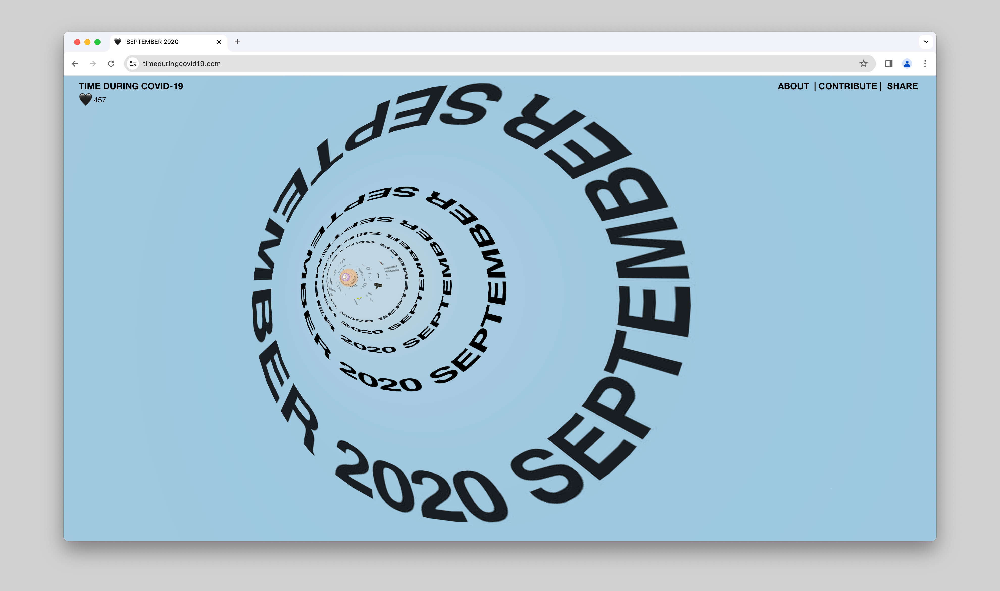
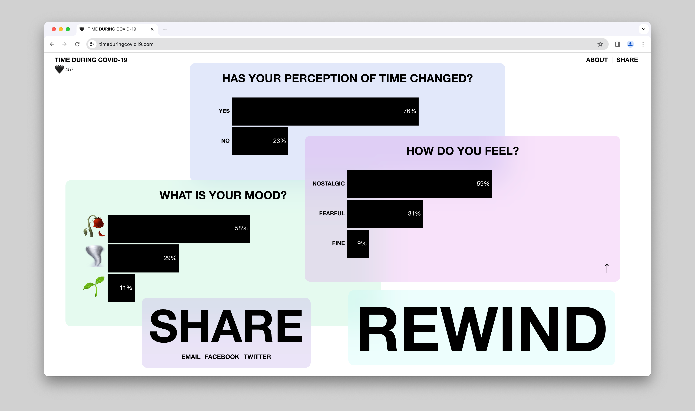

# 🌐 TIME DURING COVID-19


## About

In October 2020, I was selected as the Digital Interaction/Web Development winner of the [Creative Mentorship program](https://www.offf.barcelona/post/creative-mentorship-2020-2021-winners) organized by [Adobe](https://www.adobe.com/) and [OFFF Festival](https://www.offf.barcelona/). 

This full-stack, web app was commissioned by  [Adobe](https://www.adobe.com/) as a part of this program. I developed the app during 6 months, building everything from scratch. I was mentored by the (amazing!) design studio [Anton & Irene](https://antonandirene.com/) for the app's ideation, design, and UX. 

I presented the final website at [OFFF Festival](https://www.offf.barcelona/) 2021 edition.

## Concept

Exploring the concept of time during the Covid-19 pandemic, this project is a time capsule made with material found on social media and news feeds. 

The web app uses WebGL, an experimental web technology, to push the boundaries between web experiences and software engineering.

## Tech Stack

**Stack**: Node.js, PostgreSQL, React, WebGL, Three.js<br />
**Deployment**: Heroku

## Installation

Clone and install.

```bash
git clone https://github.com/AudreyKj/time-during-covid-19.git
cd time-during-covid-19
npm i
```

## Local development

Concurrently in 2 different tabs:
```bash
cd server
npm start
```

```bash
cd client
npm start
```

**Database** 
<br />
You will need to set up a local [PostgreSQL database](https://www.postgresql.org/download/) and set up the related environment variables. Once the database is created, connect to your database, and create the tables found in `./server/database.sql`.

## Screenshots 





## Author

- Audrey Kadjar

## License

This project is open source and available under the [MIT License](LICENSE).